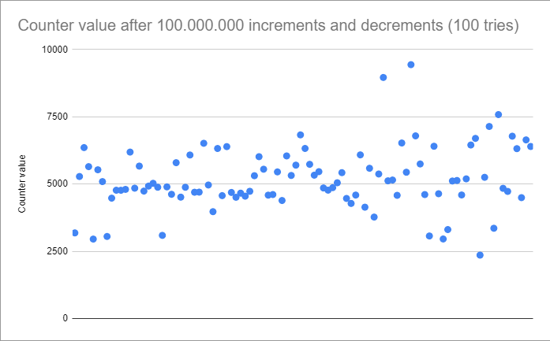

# Specs

Increase and decrease a variable on different threads 100.000.000 times. Record its final value.

# Code

The code is also available in the [Race.java](Race.java) file.

```java
public class Race {
    public static void main(String[] args) {
        Counter counter = new Counter(0);

        var iThread = new IThread(counter);
        iThread.start();

        var dThread = new DThread(counter);
        dThread.start();

        System.out.println(counter.value());
    }
}

class IThread extends Thread {

    Counter _counter;

    public IThread(Counter counter) {
        _counter = counter;
    }

    public void run() {
        for (int i = 0; i < 100_000_000; i++) {
            _counter.inc();
        }
    }
}

class DThread extends Thread {

    Counter _counter;

    public DThread(Counter counter) {
        _counter = counter;
    }

    public void run() {
        for (int i = 0; i < 100_000_000; i++) {
            _counter.dec();
        }

    }
}

class Counter {
    private int _val;

    public Counter(int n) {
        _val = n;
    }

    public void inc() {
        _val++;
    }

    public void dec() {
        _val--;
    }

    public int value() {
        return _val;
    }
}
```

# Results

100 runs have been recorded.

The following graphs illustrate the final value of the counter. On most runs, the value ends up somewhere around the ~5000 region. The average is `5189.97`.




The final value is non-deterministic, as the code is not thread-safe. Two threads access read and modify the same variable at once without any synchronization.

For example, the following behavior may happen:

1. Thread `I` (Incrementing) reads the counter's value, which is `0`.
2. Thread `D` (Decrementing) reads the counter's value, which is `0`, as thread `I` has not written the decremented value to the shared memory yet.
3. Thread `D` writes `-1` to the counter's value.
4. Thread `I` writes `1` to the counter's value.
